# Prototyping

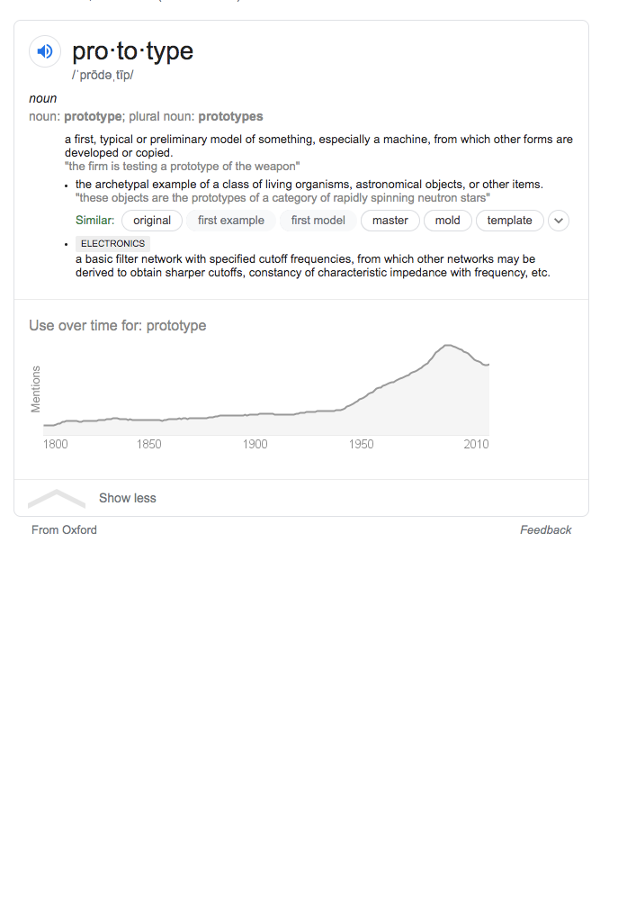

### Why Prototype?
* Focus on the solution, not coding process
* Not limited to development concerns like integration, security, scalability,
etc.
* It is easier to run through design ideas if everyone can see how things might work with their own eyes
* People are often intimidated to “imagine” working features from a static page
* You can write fewer specifications for an interactive prototype than a set of static wireframes or mock-ups
* It is easier to carry out usability testing with a prototype compared to static images and in general get lots of juicy feedback from users

## Prototype !== MVP

The fidelity of the prototype should match the progress of the project. Early ideas should be displayed low fidelity with more details shown as project matures.

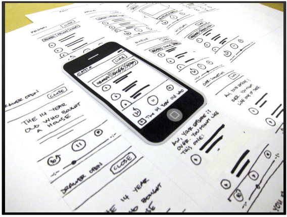

## Rapid Prototyping
The fastest, least time and least resource wasting option that best communicates your product at that point in time. Is a simple page-to-page click-thru enough or do you need an interactive prototype.
* Fast
* Efficient
* Enough

Data - complex enough to test before investing in building database. Prototype with a mock database or spreadsheet.

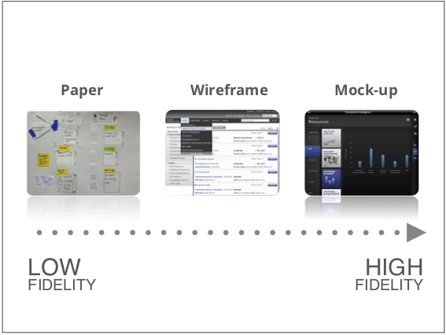
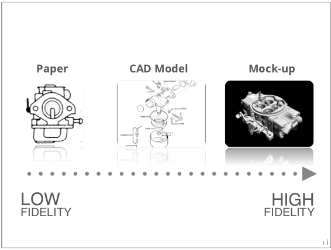

### Prototype Scope
1. What needs to be prototyped?
2. How much should be prototyped?
3. What’s the story?(tasks)
4. What’s the right level of fidelity?
5. What tool(s)work for this level?
6. What resources are necessary for this level?

[Six Steps To Superior Product Prototyping - Lessons from an Apple and Oculus Engineer](http://firstround.com/review/six-steps-to-superior-product-prototyping-lessons-from-an-apple-and-oculus-engineer/)

Map out your approach to prototyping by determining your point on a speed - caution slider. On one end is caution, and on the other end is speed.

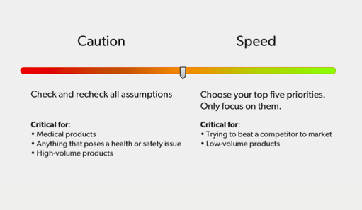

**Porftolio tip** What are you comfortable with for your portfolio?
* Big, crazy ideas that may not work but demonstrate original thinking
* **OR** a well-planned, short yet successful and pre-determined schedule?

### Meet the needs with your prototype

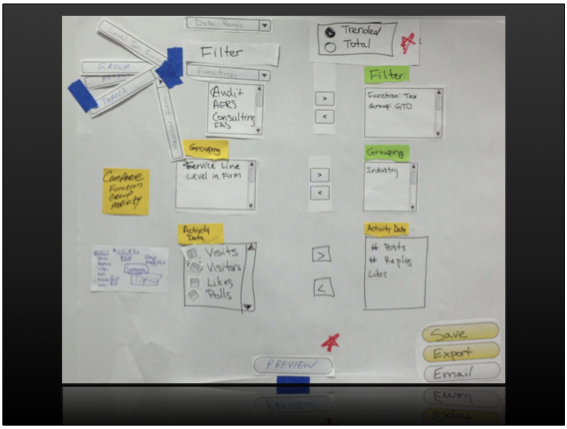
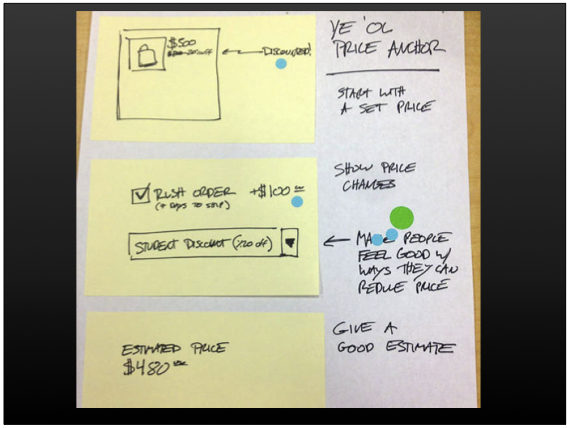
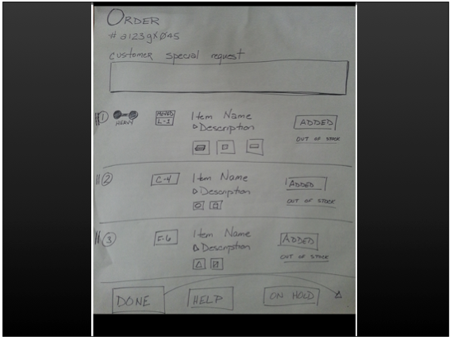
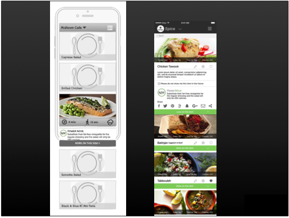

[Video: Prototyping for Elmo’s Monster Maker iPhone App](https://vimeo.com/13377903)

## Practice Rapid Prototype

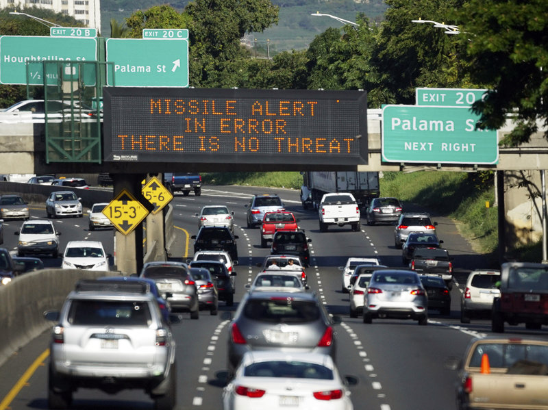
### Hawaii Panics After Alert About Incoming Missile Is Sent in Error
Jan 13, 2018. An early-morning emergency alert mistakenly warning of an incoming ballistic missile attack was dispatched to cellphones across Hawaii on Saturday, setting off widespread panic.

The alert went out at about 8:10 a.m., lighting up phones of people still in bed, having coffee by the beach at a Waikiki resort, or up for an early surf. “BALLISTIC MISSILE THREAT INBOUND TO HAWAII. SEEK IMMEDIATE SHELTER. THIS IS NOT A DRILL,” it read.

* Determine what we know?
* What is the purpose of the Missile Alert system.
* Is it a different system than a tsunami or volcano alert?
* Who operates the system?
* Was this human error? “Someone clicked the wrong thing on the computer,” Agency Spokesman.
* What is their `journey map`?
* How can this situation be avoided?

### Exercise
* Break into groups
* Spend 10 minutes deciding on key tasks/workflow to prototype
* Spend 30 minutes on a paper prototype of a new Warning System for Hawaii.
* Each group present their solution (max 15 minutes)

## Interactive Prototype with prototyping software
* **Wireframe:** Create a "Mid-Fidelity", B&W prototype that is interactive (i.e., when I click on a button, it should take me somewhere; when I click on a dropdown, I should see a list).
  * If you are designing for a mobile phone, design for iPhone 7 dimensions. It is the most common size in use today.
  * For monitors, 1280px width is a good default.
  * in this scenario, you would probably know exactly the monitor size you are designing for since it is a limited number of employees on government issued devices.
* **An example:** [NourishWise Wireframes](https://eniat7.axshare.com/#g=1&p=text_reminder). Note - this prototype is inside a phone so that it could be projected.
* You are designing a solution that may affect multiple users at the same time. It is fine to prototype just one side of the scenario for this exercise. It is realistic for one person to prototype one user's view and a co-worker to build the prototype of a different user's view. You would work together to be sure the two prototypes are in sync and work together.
* Hawaii Example: your solution might have one part that will be used by the person authorizing the alert and another sending out the alert. You would work with your co-worker to sketch out the key screens for both parties and capture the combined workflow. One person would prototype the authorizer's app and the other would prototype the sender's app.
* An example: one user may be sitting at a desk with a monitor and another user is out in the field on a mobile phone. You could create the interactive prototype of the monitor screen and display an image of the second user's phone next to it. (This is just an example, you do NOT have to build your prototype this way.)

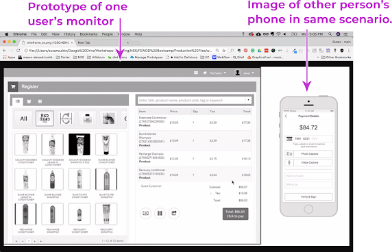

* **Remember**, your goal with any prototype is to communicate your solution. * Tell a good story.
* Focus on the key features.
* You are not reinventing the entire operation.
* You are not worried about branding.
* The prototype is meant to communicate the idea and allow you to demonstrate to decision makers, test it with users, and eventually give it to developers to build the final solution.

### Stretch Goals
* High Fidelity prototype  with color, sounds, etc.
* Prototype both sides of the system — the alert sender (the one we're redesigning) and the person(s) that decides to send the alert
* Record the call that would play (over phone/speakers/...)

Consider the following
* Who is your user?
* What is their situation, their environment?
* What key insights have you learned to drive your design?
* For page layout - what patterns work best for this scenario?
  * Asymmetric layouts, for example, create tension and dynamism — not practical for every site, but works to drive the user to focus on a particular point on the screen without disrupting visual flow.
* Don't forget to use Visual Hierarchy.

