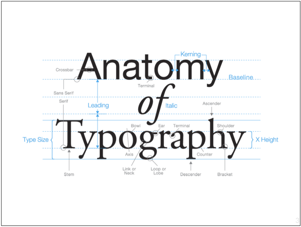
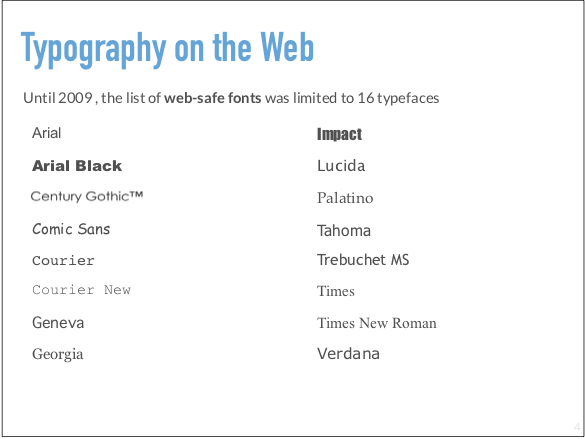
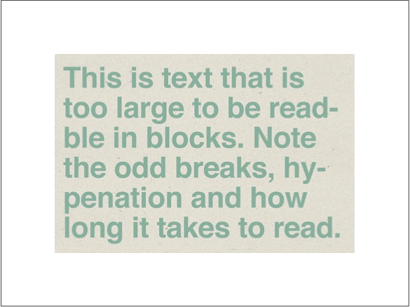
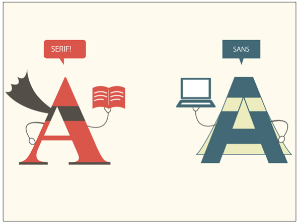
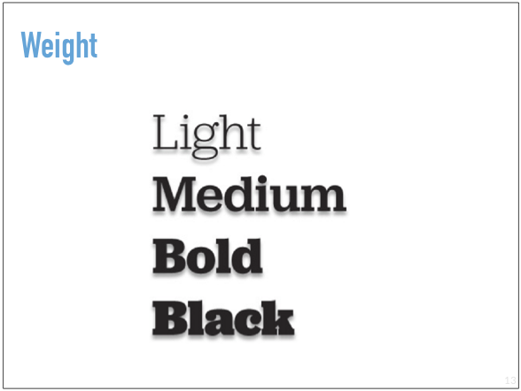
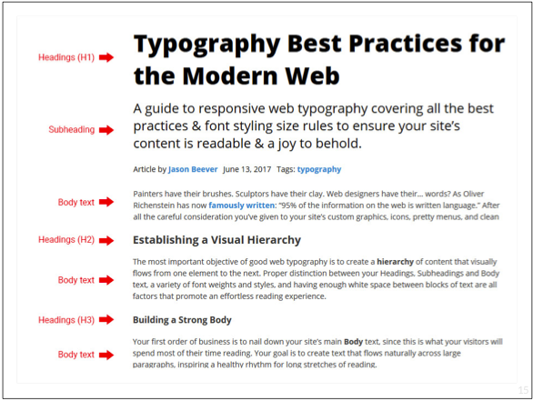
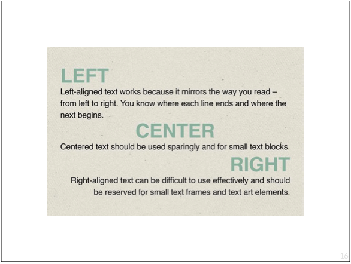
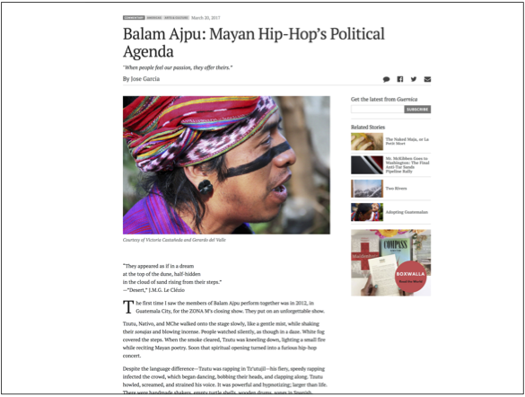

# Typography

* What is typography?
* Best practice for web fonts.

### Terms
* Typography: The visual art of creating written words. The art or procedure of arranging type or processing data and printing from it.
* Font: A set of characters of the same style and size.
* Type: Printed characters or letters.
* Typeface: A relief of the character on the face of a metal block for printing.



The early days of the web had limited fonts.


### Type Options
* [Google Fonts](https://fonts.google.com/)
* [Adobe Fonts](https://fonts.adobe.com/) Uses the `@font-face` CSS at-rule specifies a custom font with which to display text; the font can be loaded from either a remote server or a locally-installed font on the user's own computer.

Be sure to specify alternative fonts.

```css
body {
  font-family: 'Open Sans',verdana, sans-serif;
}
```

### Font Size with Various Screen Sizes
* Tailor the heading sizes according to screen size.
* As screen sizes get smaller, there are fewer elements present on the
screen, and fewer characters that can be displayed per line.
* Smaller font sizes for headers can still convey importance and hierarchy (such as reducing an H1 from 3em to 2em on smallest screens), but don’t need to shout, especially since there is less competition on the screen.
* Text will wrap more smoothly from one line to the next.

### Selecting Fonts
* Start with the paragraph ( p tag )
* Includes typeface, line length, line height, indenting, initial
capitals, link styles, and is the largest amount of text on the screen.
* Match the message or purpose of your design
* Consider context and audience
* Use suitable fonts: Display fonts are not easy to read at length; use Body fonts for readability



### Categories of Fonts







### Readability
Best line length for readability- between 45-75 characters. A line length that is too short causes the eye to jump too quickly from one line to the next. A line length that is too long causes the reader’s eye to lose track of its place.


Watch and Read
* [Web Design is 95% Typography](https://ia.net/topics/the-web-is-all-about-typography-period)
* [Web Design is 95% Typography and Mobile?](https://higheredrevolution.com/web-design-is-95-typography-and-mobile-964e8bd50d09)